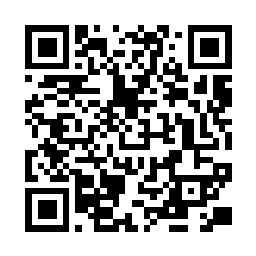

# qrc-gen-email

Email qr-code console generator.

- [qrc-gen-email](#qrc-gen-email)
  - [About](#about)
  - [How it works](#how-it-works)
  - [About env.json](#about-envjson)
    - [Variables](#variables)
      - [Table of variables](#table-of-variables)
      - [Example with all variables](#example-with-all-variables)
      - [Example with empty **subject**](#example-with-empty-subject)

## About

It generates a email qrcode in the **.png** format based on a **env.json** file.



## How it works

- first run generates **env.json** in the same directory:
  
```json
{
  "qrcSize": 256,
  "mailto": "example@example.com",
  "subject": "Example Subject"
}
```

- further you should to edit env.json file with your data
- second run generates qr code in in the same directory based on your data in env.json

## About env.json

### Variables

#### Table of variables

| Key | Value Type | Mandatory |
| ----- | ------------ | ----------- |
| **qrcSize** | int | Yes |
| **mailto** | string | Yes |
| **subject** | string | Yes, can be empty |

#### Example with all variables

```json
{
  "qrcSize": 256,
  "mailto": "example@example.com",
  "subject": "Example Subject"
}
```

#### Example with empty **subject**

- without spaces

```json
{
  "qrcSize": 256,
  "mailto": "example@example.com",
  "subject": ""
}
```

- with any spaces is allowed

```json
{
  "qrcSize": 256,
  "mailto": "example@example.com",
  "subject": "  "
}
```
